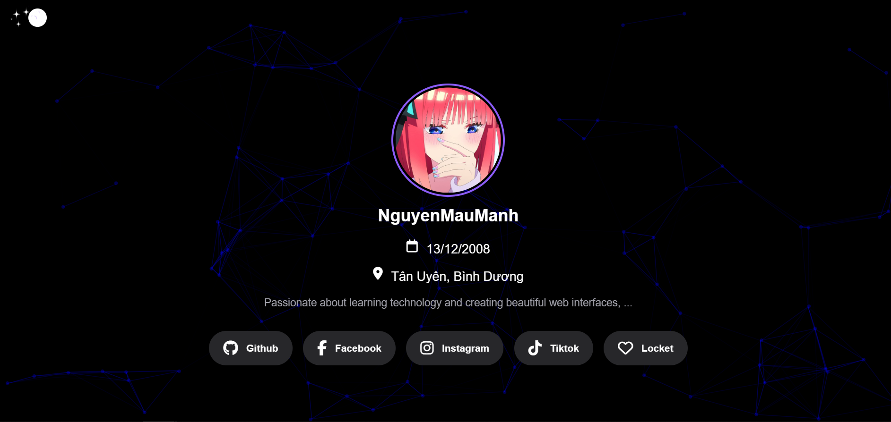
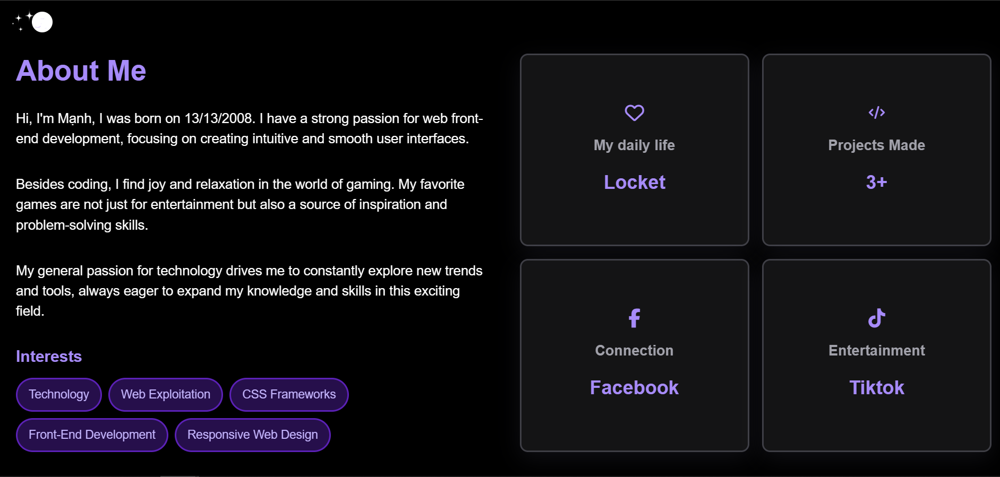

<h1>Nguyen Mau Manh - Dynamic Frontend Developer Portfolio</h1> <br><br>
A sleek, modern, and fully responsive personal portfolio website designed to showcase my skills in front-end development, user interface design, and creating engaging web experiences. This project is not just a resume; it's a live demonstration of my passion for technology and clean code.<br><br>

✨ <a href="https://maumanh.netlify.app">Live Demo</a> ✨<br>
<h1>Demo</h1>




🚀 Key Features<br>
This portfolio is built with a focus on interactivity, aesthetics, and a seamless user experience.<br>

🎨 Dual-Theme (Dark/Light Mode): A user-friendly toggle to switch between themes. The site also intelligently defaults to the user's system preference (prefers-color-scheme) on the first visit.<br>
🌌 Interactive Particle Background: A beautiful, animated particle background powered by particles.js that subtly interacts with user mouse movements, creating a dynamic and engaging atmosphere.<br>
📱 Fully Responsive Design: Meticulously crafted with a mobile-first approach, the layout is optimized to look and perform beautifully on all devices, from small mobile screens to large desktops.<br>
📝 Smart Contact Form: An intuitive contact form featuring:
Real-time, client-side validation that provides immediate feedback to the user.
Seamless Netlify integration for secure and reliable form submissions.
Success and error feedback modals to clearly communicate the status of a message.<br>
✨ Smooth Animations & Transitions:
A clean pre-loading animation ensures content is fully ready before being displayed.
Subtle hover effects and smooth transitions on interactive elements enhance the user experience.<br>
Scroll animations on various sections draw attention to content as you navigate (using the ScrollReveal library).<br>
🛡️ Enhanced User Experience & Security:
The browser tab title playfully changes when the user navigates away, encouraging them to return.
Incorporates measures to protect content by preventing right-clicking, text selection, and the use of developer tools.
🛠️ Technology Stack<br>
This project was built using a combination of modern web technologies and libraries:

Technology	Description
```
HTML5	Used for the core structure and semantics of the website.
CSS3	For all custom styling, including the responsive layout (Flexbox/Grid), animations, and the dual-theme system.
JavaScript (ES6+)	Powers all interactive features, including theme switching, DOM manipulation, and the advanced form validation logic.
Bootstrap 5	Utilized for its robust and responsive grid system to structure the project showcase section.
Particles.js	The library used to create the animated particle background.
Font Awesome	For the clean and modern icons used throughout the website.
Netlify	For seamless deployment and backend handling of the contact form submissions.
```
📂 Project Structure
The project files are organized in a clean and logical manner:
```
/
├── img/                # Contains all images for the portfolio
├── js/
│   ├── app.js          # Configuration file for particles.js
│   ├── particles.js    # The particles.js library file
│   └── script.js       # Core JavaScript for all custom interactivity and logic
├── style/
│   ├── reset.css       # CSS reset to ensure browser consistency
│   └── style.css       # Main stylesheet for all custom styles, themes, and responsiveness
├── .gitignore          # Specifies intentionally untracked files to ignore
├── index.html          # The main HTML file for the portfolio
└── README.md           # You are here!
``` 
<br>
🚀 Getting Started
To get a local copy up and running, follow these simple steps.<br>

Prerequisites
You will need a web browser and a code editor (like VS Code) to view and edit the files.

Installation
Clone the repository:<br>
```
git clone https://github.com/nguyenmanh131208/portfolio.git
```
<br>
Navigate to the project directory:<br>
```
cd portfolio
```
<br>
Open index.html in your browser: Simply open the index.html file in your favorite web browser to view the website locally. No complex build steps are required.<br>
📫 Let's Connect!<br>
I'm always open to connecting, collaborating, or discussing new opportunities. Feel free to reach out!

GitHub: <a href="https://github.com/nguyenmanh131208">@nguyenmanh131208</a><br>
Facebook: <a href="https://facebook.com/NMMiuEm">Nguyễn Mậu Mạnh</a><br>
Instagram: <a href="https://instagram.com/NMMiuEm">Nguyễn Mậu Mạnh</a><br>
Email: You can also reach out to me via the contact form on the website!